# Gemini CLI 架构与流程图

> 可视化 Gemini CLI 的架构、工作流程和最佳实践

## 📊 目录

1. [整体架构](#整体架构)
2. [工作流程](#工作流程)
3. [GEMINI.md 加载机制](#geminimd-加载机制)
4. [MCP 集成架构](#mcp-集成架构)
5. [上下文管理流程](#上下文管理流程)
6. [开发工作流](#开发工作流)

---

## 整体架构

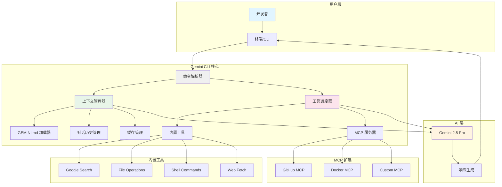

### 架构说明

| 组件 | 功能 | 作用 |
|------|------|------|
| **命令解析器** | 解析用户输入 | 识别命令、参数、斜杠命令 |
| **上下文管理器** | 管理上下文信息 | 加载 GEMINI.md、管理对话历史 |
| **工具调度器** | 调度工具执行 | 选择合适的工具完成任务 |
| **内置工具** | 基础功能 | 搜索、文件、Shell、网页 |
| **MCP 服务器** | 扩展功能 | 自定义集成和外部服务 |

---

## 工作流程

### 基本交互流程

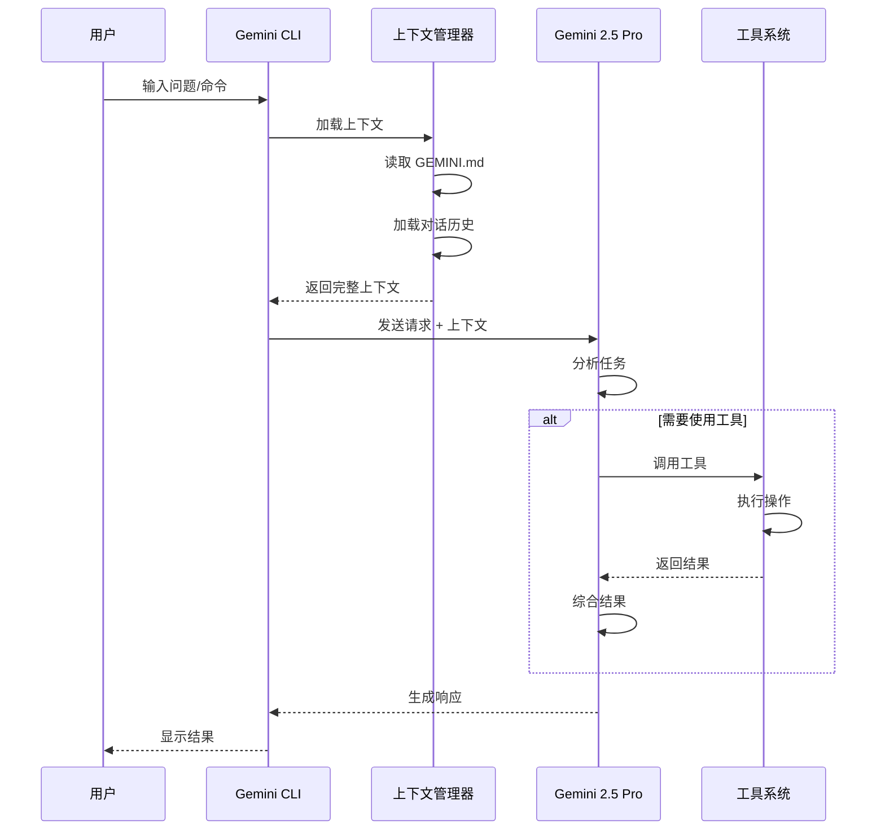

### 完整请求生命周期

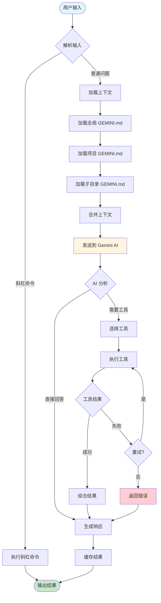

---

## GEMINI.md 加载机制

### 分层加载流程

```mermaid
graph TD
    Start([启动 Gemini CLI]) --> CheckCwd[检查当前目录]

    CheckCwd --> FindRoot[查找项目根目录]
    FindRoot --> LoadSequence{开始加载序列}

    LoadSequence --> L1[1. 加载全局配置]
    L1 --> L1Path[~/.gemini/GEMINI.md]
    L1Path --> L1Exists{文件存在?}

    L1Exists -->|是| L1Load[加载到上下文]
    L1Exists -->|否| L2[2. 加载项目根配置]
    L1Load --> L2

    L2 --> L2Path[/project-root/GEMINI.md]
    L2Path --> L2Exists{文件存在?}

    L2Exists -->|是| L2Load[加载到上下文]
    L2Exists -->|否| L3[3. 加载子目录配置]
    L2Load --> L3

    L3 --> L3Path[/current-dir/GEMINI.md]
    L3Path --> L3Exists{文件存在?}

    L3Exists -->|是| L3Load[加载到上下文]
    L3Exists -->|否| L4[4. 扫描 @imports]
    L3Load --> L4

    L4 --> ParseImports[解析 @file.md 语法]
    ParseImports --> LoadImports[递归加载导入文件]
    LoadImports --> Merge[合并所有配置]

    Merge --> Priority{处理优先级}
    Priority --> Override[子目录覆盖项目根]
    Override --> Override2[项目根覆盖全局]

    Override2 --> Final[生成最终上下文]
    Final --> Ready([准备就绪])

    style Start fill:#e1f5ff
    style Ready fill:#c8e6c9
    style Final fill:#fff4e1
```

### 配置优先级示例

```mermaid
graph LR
    subgraph "优先级: 低"
        A[~/.gemini/GEMINI.md<br/>全局配置]
    end

    subgraph "优先级: 中"
        B[/project/GEMINI.md<br/>项目配置]
    end

    subgraph "优先级: 高"
        C[/project/src/GEMINI.md<br/>子目录配置]
    end

    A -->|被覆盖| B
    B -->|被覆盖| C
    C --> D[最终上下文]

    style A fill:#e3f2fd
    style B fill:#fff9c4
    style C fill:#c8e6c9
    style D fill:#ffecb3
```

---

## MCP 集成架构

### MCP 服务器通信流程

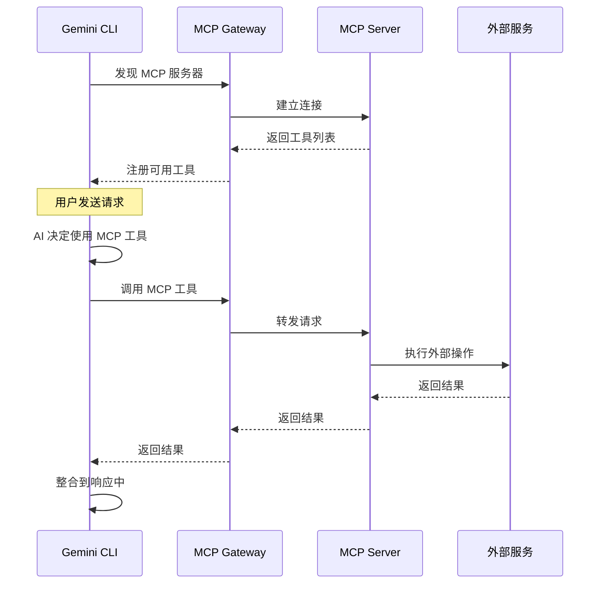

### MCP 扩展架构

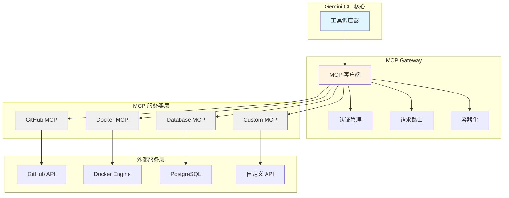

---

## 上下文管理流程

### 上下文生命周期

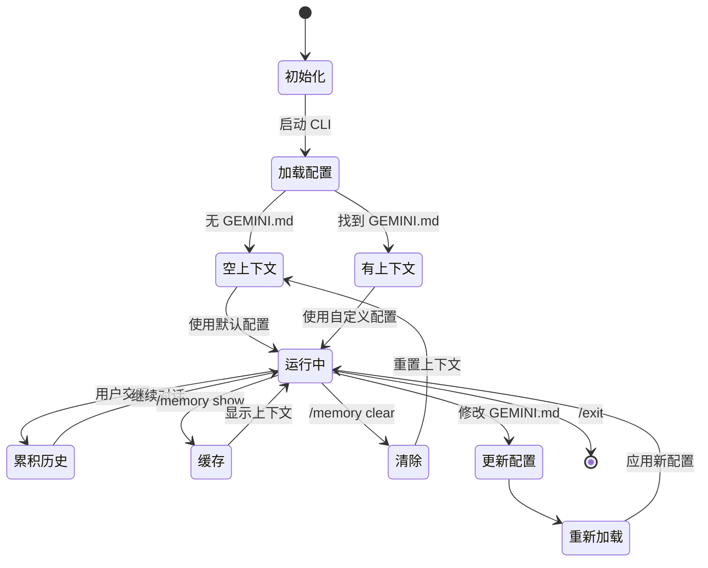

### 上下文优化策略

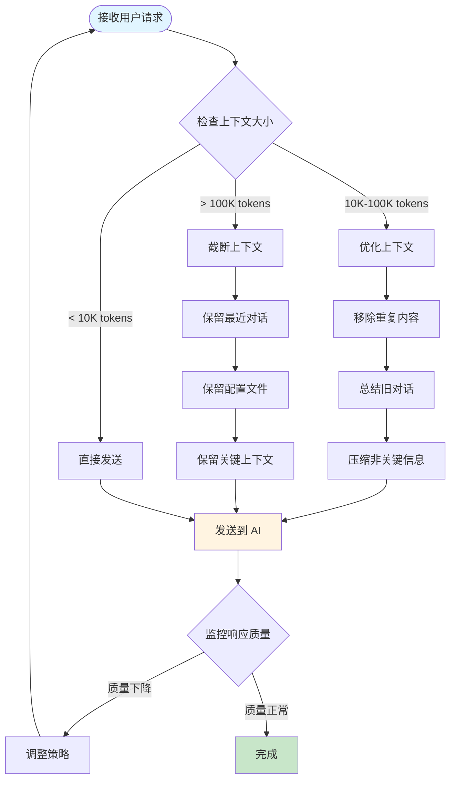

---

## 开发工作流

### PRD 驱动开发流程

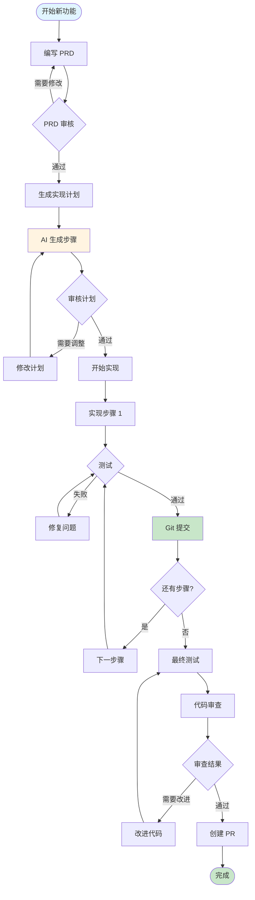

### 增量开发模式

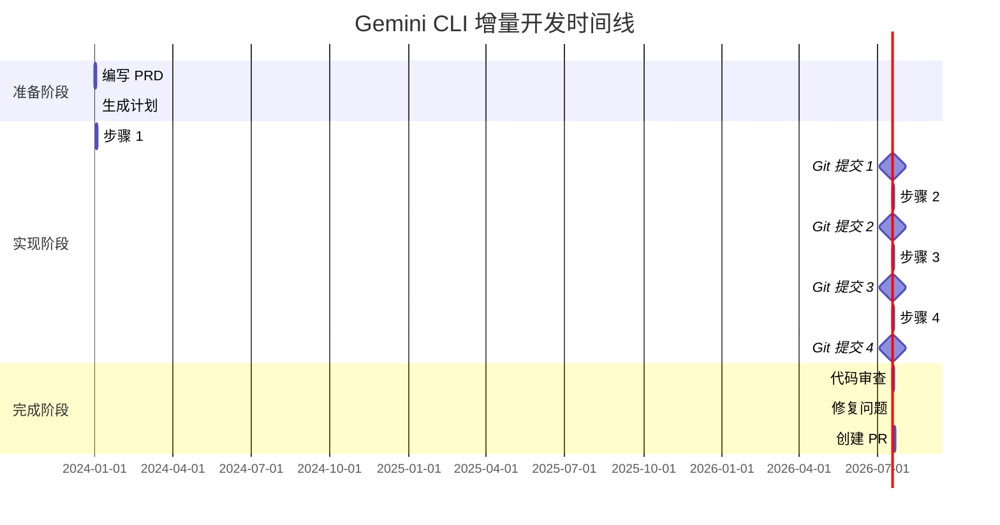

### 提示词优化流程

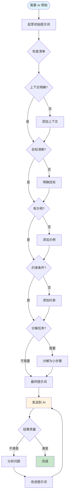

---

## 最佳实践决策树

### 选择合适的工作方式

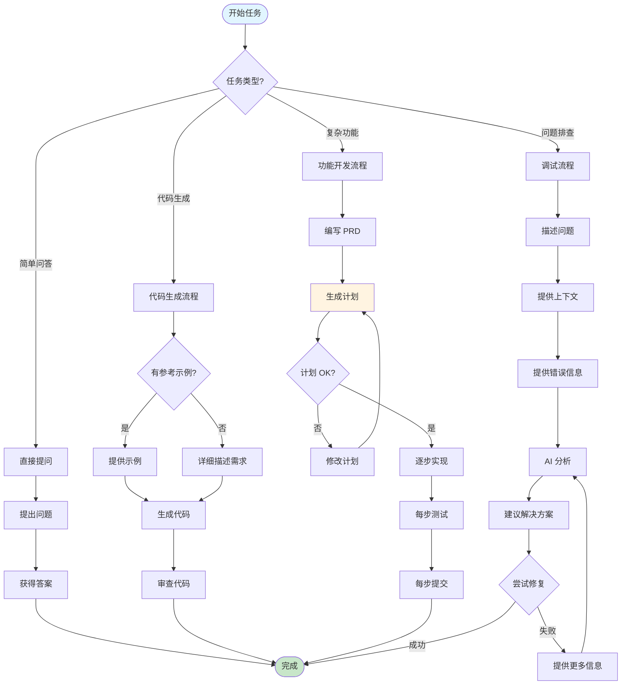

---

## 性能优化流程

### 请求优化策略

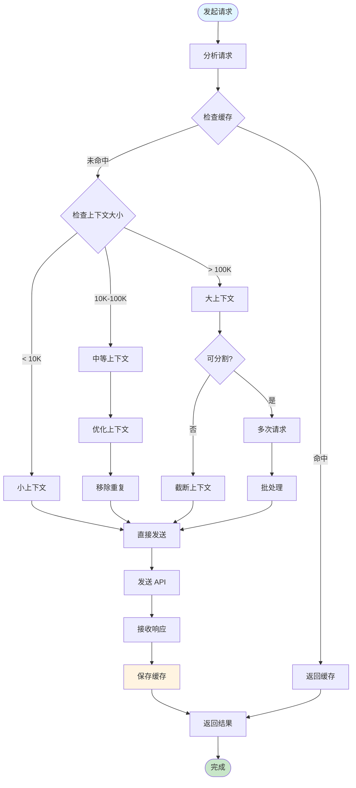

---

## 总结

### 关键流程要点

| 流程 | 核心原则 | 最佳实践 |
|------|----------|----------|
| **初始化** | 自动加载配置 | 使用 `/init` 生成模板 |
| **上下文管理** | 分层覆盖 | 全局 → 项目 → 子目录 |
| **工具调用** | 自动调度 | 信任 AI 选择工具 |
| **MCP 集成** | 扩展功能 | 使用标准协议 |
| **开发工作流** | 增量提交 | 小步骤、频繁测试 |
| **性能优化** | 控制上下文 | 缓存、批处理、截断 |

### 快速参考

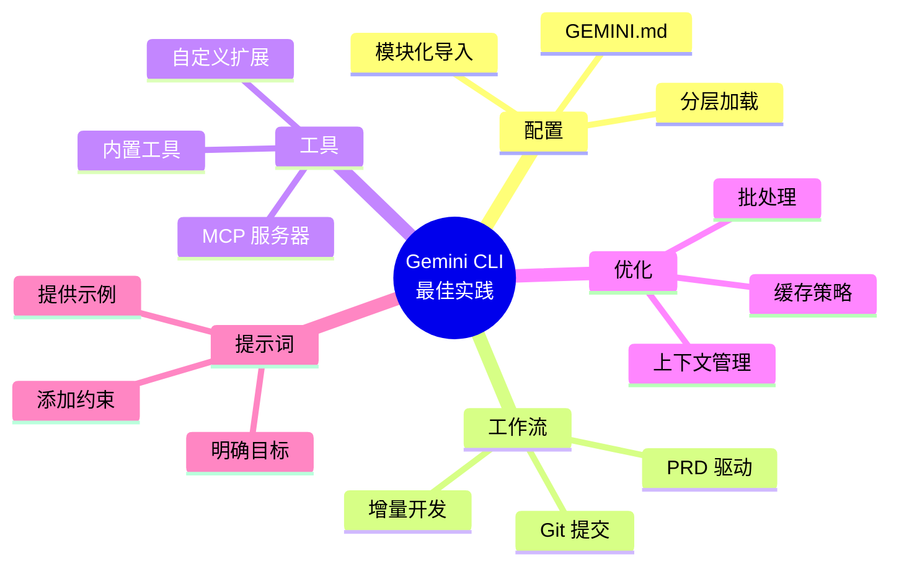

---

**文档版本**: v1.0.0
**最后更新**: 2025-01-29
**维护者**: gemini-guide 团队

💡 **使用提示**:
- 在支持 Mermaid 的编辑器中查看（VS Code + Markdown Preview Mermaid Support 插件）
- GitHub 自动渲染 Mermaid 图表
- 可使用 [Mermaid Live Editor](https://mermaid.live/) 在线预览和编辑
