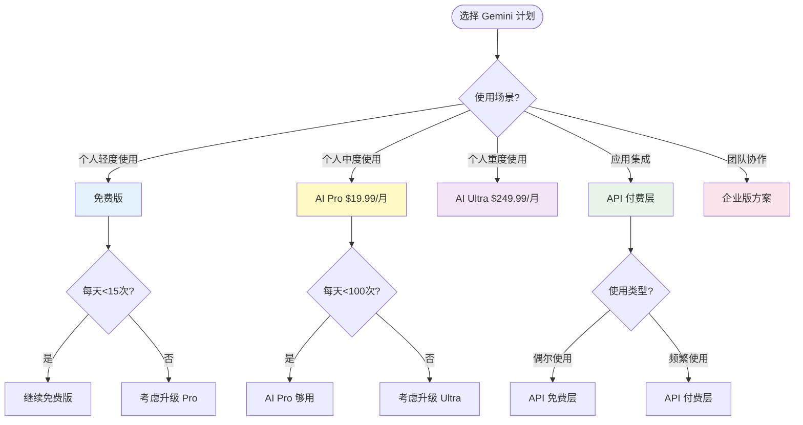
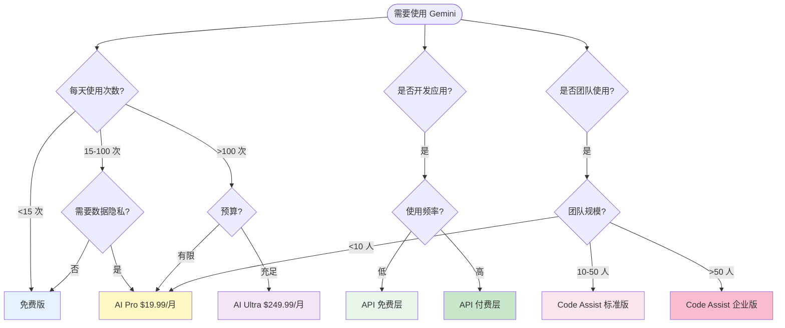

# Gemini 订阅计划详细对比（2025年）

> 完整的 Gemini 定价、限制和选择指南

## 📋 目录

1. [订阅计划总览](#订阅计划总览)
2. [免费版详细说明](#免费版详细说明)
3. [Google AI Pro 详细说明](#google-ai-pro-详细说明)
4. [Google AI Ultra 详细说明](#google-ai-ultra-详细说明)
5. [API 付费层详细说明](#api-付费层详细说明)
6. [企业版方案](#企业版方案)
7. [详细对比表](#详细对比表)
8. [选择建议](#选择建议)
9. [常见问题](#常见问题)

---

## 订阅计划总览



---

## 免费版详细说明

### 基本信息

- **价格**: $0（完全免费）
- **适合人群**: 个人轻度用户、尝鲜用户
- **访问方式**: [gemini.google.com](https://gemini.google.com/)

### 功能限制

| 功能项 | 限制 |
|--------|------|
| **每日请求** | 约 15-50 次（根据复杂度） |
| **上下文窗口** | 32,000 tokens（约 24,000 个英文单词） |
| **存储空间** | 15GB Google One 存储 |
| **视频上传** | 最长 5 分钟 |
| **图片上传** | 支持 |
| **NotebookLM** | 3 个音频概览/天 |
| **Deep Research** | 有限访问 |
| **速率限制** | 10-50 RPM（根据地区） |

### 数据使用政策

⚠️ **重要**: 免费版的提示和响应可能被 Google 用于改进产品

### 使用建议

✅ **适合场景**:
- 偶尔使用 AI 助手
- 简单问答和文本生成
- 学习和探索 Gemini 功能
- 预算有限的个人用户

❌ **不适合**:
- 每天频繁使用（> 15 次）
- 需要数据隐私保护
- 处理长文档（> 32K tokens）
- 专业工作场景

---

## Google AI Pro 详细说明

### 基本信息

- **价格**: $19.99/月（约 ¥145/月）
- **别名**: Google One AI Premium、Gemini Advanced
- **适合人群**: 个人重度用户、专业人士、小团队

### 完整功能列表

#### 核心功能提升

| 功能项 | 免费版 | AI Pro |
|--------|--------|--------|
| **每日请求** | 15-50 次 | **约 100 次** |
| **上下文窗口** | 32K tokens | **1M tokens** (1,500 页) |
| **存储空间** | 15GB | **2TB** |
| **视频上传** | 5 分钟 | **1 小时** |
| **配额重置** | 每 12-24 小时 | 每 12-24 小时 |

#### NotebookLM Pro

| 功能 | 免费版 | AI Pro |
|------|--------|--------|
| 音频概览 | 3/天 | **20/天** |
| 笔记本数量 | 有限 | **最多 500 个** |
| 每个笔记本的来源 | 有限 | **最多 300 个** |
| 聊天查询 | 有限 | **500/天** |

#### Deep Research

- ✅ 使用 Gemini 2.5 Pro 的完整访问权限
- ✅ 更深入的研究能力
- ✅ 更详细的报告生成

#### 其他优势

- ✅ **数据隐私**: 提示和响应不会用于改进产品
- ✅ **优先访问**: 新功能优先体验
- ✅ **高级模型**: 访问 Gemini 2.5 Pro 和实验性模型
- ✅ **Gmail 集成**: 智能撰写和总结（如果订阅 Workspace）

### 价格对比

| 地区 | 月费 | 年费（节省） |
|------|------|-------------|
| 美国 | $19.99 | - |
| 中国 | 约 ¥145 | - |
| 包含 | 2TB 存储 + AI Pro | - |

### 使用场景

✅ **最适合**:
- 每天使用 Gemini 进行工作（50-100 次请求）
- 处理长文档、代码、报告
- 使用 NotebookLM 进行研究和学习
- 需要数据隐私保护
- 需要大量云存储空间（2TB）

### 升级方式

```bash
1. 访问 https://one.google.com/about/ai-premium/
2. 登录 Google 账号
3. 选择 AI Premium 计划
4. 完成支付
```

---

## Google AI Ultra 详细说明

### 基本信息

- **价格**: $249.99/月（约 ¥1,815/月）
- **适合人群**: 专业用户、企业高级用户、重度 AI 使用者

### 相比 AI Pro 的提升

| 功能项 | AI Pro | AI Ultra |
|--------|--------|----------|
| **每日请求** | ~100 次 | **更高** |
| **模型访问** | Gemini 2.5 Pro | **最先进模型** |
| **上下文处理** | 1M tokens | **扩展能力** |
| **视频生成** | 基础 | **专业级** |
| **代码生成** | 标准 | **专业级** |
| **多模态** | 标准 | **专业级** |
| **支持级别** | 标准 | **优先支持** |

### 高级功能

- ✅ 访问最新的实验性模型
- ✅ 更高的请求配额和速率限制
- ✅ 扩展的上下文处理能力
- ✅ 专业级内容生成（视频、音频、图像）
- ✅ 优先客户支持
- ✅ 早期访问新功能

### 使用场景

✅ **适合**:
- 专业内容创作者
- AI 研究人员
- 需要最先进模型能力的企业用户
- 每天超过 100 次请求的重度用户

❌ **不适合**:
- 个人轻度/中度用户（性价比低）
- 预算有限的小团队

---

## API 付费层详细说明

### 免费层（AI Studio）

#### 基本额度

```
✅ 免费额度:
- Gemini 2.5 Pro/Flash: 1,500 提示/天
- 速率限制: 10-50 RPM（根据地区和账户年龄）
- 无需信用卡
```

#### 限制

- ⚠️ Google 可能使用数据改进产品
- ⚠️ 严格的速率限制
- ⚠️ 功能受限

### 付费层定价

#### 按百万 Token 计费（2025年1月）

| 模型 | 输入价格 | 输出价格 | 长上下文(>200K) |
|------|----------|----------|----------------|
| **Flash-Lite** | $0.10 | $0.40 | - |
| **2.0 Flash** | $0.10 | $0.40 | - |
| **2.5 Flash** | $0.30 | $2.50 | - |
| **2.5 Pro** | $1.25 | $10.00 | 2倍价格 |
| **3 Pro Preview** | $2.00 | $12.00 | - |

#### Context Caching 定价

| 操作 | 2.5 Flash | 2.5 Pro |
|------|-----------|---------|
| **Cache 写入** | 与输入价格相同 | 与输入价格相同 |
| **Cache 读取** | $0.03 (10%) | $0.125 (10%) |
| **Cache 存储** | $1/百万 tokens/小时 | $4.5/百万 tokens/小时 |

### 成本优化技巧

#### 1. 使用 Batch API

```
标准价格: $1.25/M tokens (输入)
Batch 价格: $0.625/M tokens (输入) ← 50% 折扣
```

#### 2. 启用 Context Caching

```
场景: 重复使用相同上下文
节省: 最多 90%
Cache 读取: 仅需标准价格的 10%
```

#### 3. 选择合适的模型

```
简单任务: Flash-Lite ($0.10/$0.40)
一般任务: 2.5 Flash ($0.30/$2.50)
复杂任务: 2.5 Pro ($1.25/$10)
最高质量: 3 Pro Preview ($2/$12)
```

### 成本计算示例

#### 示例 1: 日常聊天应用

```
场景: 每天 1000 次对话
平均输入: 500 tokens
平均输出: 300 tokens
使用模型: 2.5 Flash

月成本:
输入: 1000 × 30 × 500 / 1,000,000 × $0.30 = $4.50
输出: 1000 × 30 × 300 / 1,000,000 × $2.50 = $22.50
总计: $27/月
```

#### 示例 2: 文档分析（使用 Caching）

```
场景: 分析 100 个文档，每个 50K tokens
每个文档问 10 个问题
使用模型: 2.5 Pro

不使用 Caching:
输入: 100 × 10 × 50K / 1M × $1.25 = $62.50

使用 Caching:
首次: 100 × 50K / 1M × $1.25 = $6.25
后续 9 次: 100 × 9 × 50K / 1M × $0.125 = $5.625
总计: $11.875 (节省 81%)
```

### 付费层优势

✅ **数据隐私**: 提示和响应绝不用于改进产品
✅ **无日限制**: 按用量付费，无每日请求上限
✅ **高速率**: 更高的 RPM/RPD 限制
✅ **高级功能**: Grounding with Google Search 等
✅ **灵活计费**: 只为实际使用付费

---

## 企业版方案

### Gemini for Google Workspace

#### 基本信息

- **定价**: 需联系销售获取报价
- **适合**: 使用 Google Workspace 的团队和企业

#### 主要功能

- ✅ Gmail 中的 AI 辅助撰写和总结
- ✅ Google Docs 中的智能协作
- ✅ Google Sheets 中的数据分析
- ✅ Google Slides 中的内容生成
- ✅ Google Meet 中的实时字幕和总结
- ✅ 企业级安全和合规

#### 版本

**传统加购项已停止销售**，新方案：
- **Google AI Ultra for Business**: 企业级高级方案

### Gemini Code Assist

#### 版本对比

| 功能 | 标准版 | 企业版 |
|------|--------|--------|
| **代码补全** | ✅ | ✅ |
| **代码解释** | ✅ | ✅ |
| **单元测试生成** | ✅ | ✅ |
| **代码审查** | ✅ | ✅ |
| **自定义代码库** | ❌ | ✅ |
| **企业安全** | 基础 | 高级 |
| **SLA 保障** | ❌ | ✅ |

#### 定价特点

- 按月或按年计费
- 年度订阅享受折扣
- 新客户首月最多 50 个免费许可证

#### 订阅管理

```
✅ 可以: 标准版 → 企业版（立即生效）
⚠️ 限制: 企业版 → 标准版（需等订阅期结束）
```

### 企业方案选择建议

| 团队规模 | 推荐方案 |
|---------|---------|
| 1-10 人 | AI Pro（个人订阅） |
| 10-50 人 | Code Assist 标准版 + Workspace 集成 |
| 50-200 人 | Code Assist 企业版 + AI Ultra for Business |
| 200+ 人 | 定制企业方案（联系销售） |

---

## 详细对比表

### 核心功能对比

| 功能 | 免费版 | AI Pro | AI Ultra | API 免费 | API 付费 |
|------|--------|--------|----------|----------|----------|
| **日请求** | 15-50 | ~100 | 更高 | 1500 | 无限 |
| **上下文** | 32K | 1M | 1M+ | 视模型 | 视模型 |
| **存储** | 15GB | 2TB | 2TB+ | - | - |
| **数据隐私** | ❌ | ✅ | ✅ | ❌ | ✅ |
| **高级模型** | ❌ | ✅ | ✅✅ | ✅ | ✅ |
| **Search Grounding** | 有限 | ✅ | ✅ | 有限 | ✅ |
| **NotebookLM** | 基础 | Pro | Pro | - | - |
| **Deep Research** | 有限 | ✅ | ✅ | - | - |
| **优先支持** | ❌ | ❌ | ✅ | ❌ | ✅ |

### 价格对比

| 方案 | 月费 | 年费 | 性价比 |
|------|------|------|--------|
| **免费版** | $0 | $0 | ⭐⭐⭐⭐⭐ |
| **AI Pro** | $19.99 | - | ⭐⭐⭐⭐ |
| **AI Ultra** | $249.99 | - | ⭐⭐⭐ |
| **API 免费** | $0 | $0 | ⭐⭐⭐⭐⭐ |
| **API 付费** | 按用量 | 按用量 | ⭐⭐⭐⭐ |

---

## 选择建议

### 决策流程图



### 按使用场景选择

#### 个人学习/探索

**推荐**: 免费版
- ✅ 无成本
- ✅ 基础功能完整
- ⚠️ 接受数据使用政策

#### 个人专业工作

**推荐**: AI Pro ($19.99/月)
- ✅ 足够的配额（100 次/天）
- ✅ 长上下文（1M tokens）
- ✅ 数据隐私保护
- ✅ 2TB 存储

#### 重度专业用户

**推荐**: AI Ultra ($249.99/月)
- ✅ 更高配额
- ✅ 最先进模型
- ✅ 优先支持

#### 应用开发集成

**推荐**: API 付费层
- ✅ 按需付费
- ✅ 完全数据隐私
- ✅ 无日限制
- ✅ 成本可控（使用 Caching）

#### 团队协作

**推荐**: Code Assist + Workspace
- ✅ 统一管理
- ✅ 企业安全
- ✅ 团队协作功能

---

## 常见问题

### Q1: 免费版配额用完了怎么办？

**回答**:
1. 等待 12-24 小时配额重置
2. 升级到 AI Pro（即时生效）
3. 使用 API 免费层（1500 次/天）

### Q2: AI Pro 的 100 次/天够用吗？

**回答**:
- **够用**: 日常工作、学习、中度使用
- **不够**: 频繁长对话、批量处理、开发调试
- **建议**: 监控使用量，不够再升级 Ultra 或使用 API

### Q3: API 付费层比订阅便宜吗？

**回答**:
取决于使用量。以 2.5 Flash 为例：

```
AI Pro: $19.99/月 固定费用

API 付费层（假设每天 50 次，每次 1K tokens）:
- 月成本: 50 × 30 × 1K / 1M × ($0.30 + $2.50) = $4.2/月

结论: 轻度使用 API 更便宜，重度使用订阅更划算
```

### Q4: 可以在 AI Pro 和 API 之间切换吗？

**回答**:
- ✅ 可以同时使用两者
- ✅ AI Pro 用于 web/移动应用
- ✅ API 用于开发和集成
- ⚠️ 两者配额独立计算

### Q5: 企业版如何计费？

**回答**:
- 按用户/许可证计费
- 支持月付和年付
- 年付通常有折扣
- 需联系销售获取准确报价

### Q6: 数据隐私保护具体指什么？

**回答**:

| 版本 | 数据使用 |
|------|---------|
| 免费版 | 可能用于改进产品 |
| 付费版 | 不会用于改进产品 |
| API 免费 | 可能用于改进产品 |
| API 付费 | 不会用于改进产品 |

### Q7: 可以随时取消订阅吗？

**回答**:
- ✅ 可以随时取消
- ✅ 取消后当前订阅期内仍可使用
- ✅ 到期后自动降级为免费版
- ⚠️ 已支付费用不退款

### Q8: 学生有优惠吗？

**回答**:
- ❌ AI Pro/Ultra 暂无学生优惠
- ✅ API 免费层对所有人开放
- 💡 建议学生使用免费版或 API 免费层

---

## 总结与建议

### 最佳实践

1. **从免费版开始**: 了解功能和使用量
2. **监控使用**: 记录每日请求次数
3. **按需升级**: 配额不够时再升级
4. **混合使用**: Web 用订阅，API 用付费层
5. **优化成本**: 使用 Caching、Batch API

### 2025 年推荐配置

| 用户类型 | 推荐方案 | 月成本 |
|---------|---------|--------|
| 学生 | 免费版 | $0 |
| 个人用户 | AI Pro | $19.99 |
| 开发者 | API 付费层 | $10-50 |
| 小团队（<10人） | AI Pro × N | $19.99 × N |
| 中型团队（10-50人） | Code Assist 标准版 | 咨询销售 |
| 大型企业（>50人） | Code Assist 企业版 | 咨询销售 |

---

## 参考资源

### 官方链接

- [Google One AI Premium](https://one.google.com/about/ai-premium/)
- [Gemini API 定价](https://ai.google.dev/gemini-api/docs/pricing)
- [Gemini for Google Cloud 价格](https://cloud.google.com/products/gemini/pricing)
- [Code Assist 文档](https://developers.google.com/gemini-code-assist/docs/admin)

### 价格计算器

- [Gemini API Cost Calculator](https://costgoat.com/pricing/gemini-api)
- [API Pricing Guide](https://blog.laozhang.ai/ai-models/gemini-api-price-guide-2025/)

### 详细分析

- [Gemini AI Pricing: What You'll Really Pay](https://www.cloudzero.com/blog/gemini-pricing/)
- [Gemini Pricing Guide 2025](https://www.cloudeagle.ai/blogs/blogs-google-gemini-pricing-guide)
- [Google Gemini Pricing Explained](https://www.godofprompt.ai/blog/google-gemini-pricing)

---

**文档版本**: v1.0.0
**最后更新**: 2025-01-29
**价格更新**: 2025-01-29

⚠️ **重要提示**: 价格和功能可能随时变化，请以官方网站为准。

💡 **建议**: 将此页面添加到书签，定期查看更新。
